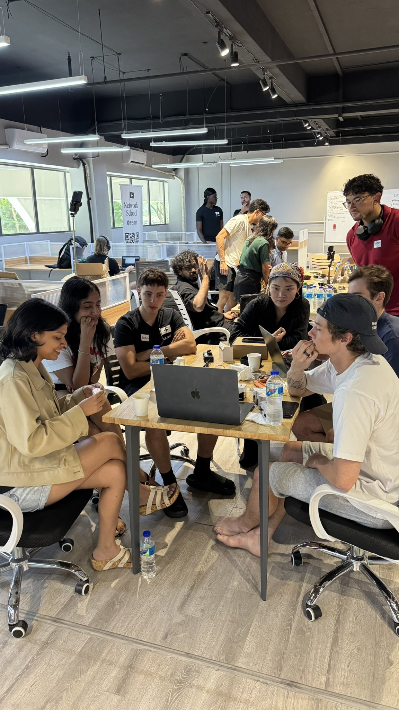

<section class="intro">

</section>

## Current Status

Currently exploring machine learning, cryptography, governance, and Southeast Asia at [Network School](https://ns.com/).

## Recent work history

[Rainmaker Technology Corporation](https://www.rainmaker.com/) - Forward Deployed Engineer

## Projects

At <a href="https://ns.com/" target="_blank" rel="noopener">Network School</a>, I <a href="https://x.com/0xJarrett/status/1959995784872841452" target="_blank" rel="noopener">taught a robotics class</a> with my co-host <a href="https://www.linkedin.com/in/lana-shevchenko/" target="_blank" rel="noopener">Lana</a>.  We were able to take a room of complete robotics novices and had them assemble and program a series of <a href="https://github.com/TheRobotStudio/SO-ARM100" target="_blank" rel="noopener">SO-ARM100 robotic arms</a> in just a few hours.  Our students also learned how to operate a 3D printer.

<a href="https://www.kaggle.com/code/bjrnste/path-to-the-amazon-sun-gods#2.-Download-the-Terrabrasilis-deforestation-data-&-Define-the-AOI-around-the-Indigenous-Territories-uncovered-above" target="_blank" rel="noopener">My team's submission</a> for the <a href="https://openai.com/openai-to-z-challenge/" target="_blank" rel="noopener">OpenAI-to-Z challenge</a>.  Process large amounts of satellite data to scan the Amazonian rainforest for undiscovered ruins and earthworks.  A Jupyter notebook that utilizes essential data science tools such as numpy, pandas, matplotlib, and more niche tooling such as geopandas and rasterio.  Large-scale image classification.

<a href="https://github.com/JR-Vickers/a16z_job_skills/blob/main/main.ipynb" target="_blank" rel="noopener">I recently analyzed</a> the job boards for <a href="https://www.linkedin.com/posts/jordanmazer_these-35-andreessen-horowitz-backed-companies-activity-7320077608052764672-A2Kg/?utm_source=share&utm_medium=member_desktop&rcm=ACoAACxXoykB8aL2eDtVoQzAVrRBauNOqQkoC4w" target="_blank" rel="noopener">35 a16z-backed startups</a> that are currently hiring.  I identified the most in-demand skills for these startups.  Spoilers: the Go programming language is number one, closely followed by Python.  PyTorch was the only library that made the list, reflecting the current AI wave.

<a href="https://galaxy-generator-seven-kappa.vercel.app/" target="_blank" rel="noopener">Galaxy Generator.</a> A fun little toy project.  Simulate gravity and galaxy formation.  Made with Next.js, Typescript, and Tailwind CSS.

