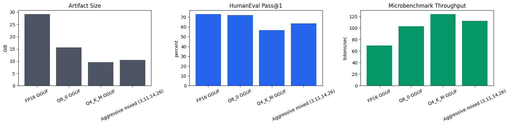
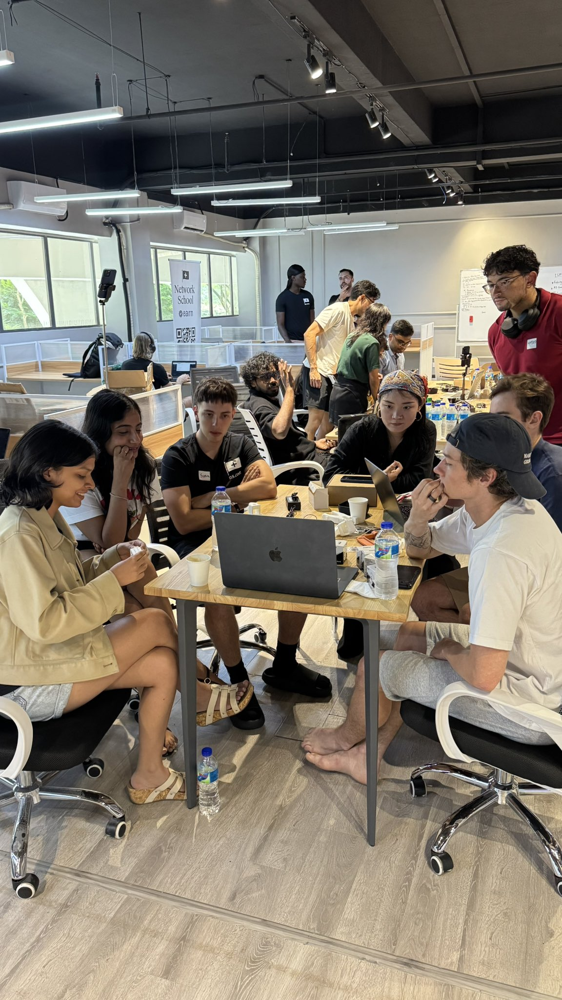

<section class="intro">

</section>

## Current Status

I recently received a [grant](https://blog.cosmos-institute.org/p/announcing-80-new-cosmos-grantees) from the [Cosmos Institute](https://cosmos-institute.org) to build the <b>Compression Integrity Bench</b>.

>_Decentralized AI is premised on open-weight models running on local hardware. But almost nobody runs them at full precision. LLM deployments are implemented under various inference optimization regimes, such as quantization. Quantized LLM deployments are evaluated on task performance, but not on epistemic behavior. Careless quantization does more than just degrade performance - it disproportionately affects low-magnitude weights and the tails of the output distribution. If hedging, alternative hypotheses, and dissent live in those tails, then quantization could cause epistemic degradation. If this compromises the ability of open-weight models to maintain epistemic integrity, then the promise of decentralized AI may remain unrealized._

>_LLM epistemic integrity - such as calibrated uncertainty, (resistance to) sycophancy, willingness to perform Bayesian updates, use of references, and steelmanning opposition - are all implemented late in the LLM training process, in post-training. Research has shown that post-trained behaviors degrade under quantization, which suggests that epistemic integrity may be compromised. LLM epistemic integrity under quantization has never been rigorously researched and documented. You should be able to know if the local model you chose behaves faithfully to the one you think you're running._

 
 
In my spare time, I teach machine learning at [Network School](https://ns.com/) in Astana, Kazakhstan.

## Projects

I ran a <a href="https://github.com/JR-Vickers/quantization-study" target="_blank" rel="noopener">quantization study</a> on an open-source coding model, DeepSeek-Coder-V2-Lite-Instruct.
 
 
The goals of this project were to 1) teach myself inference engineering by jumping into the deep end of the pool, and 2) extensively document this process in a series of notebooks so that I could use them to teach inference engineering to others.
 
 
The intent was to quantize the model as heavily as possible without degrading performance too badly.  Quantizing from 16-bit to 8-bit integers had minimal impact on the HumanEval results, while substantially reducing model size and increasing token/sec.  We see more model errors at 4-bit quantization, which I was able to mitigate by running sensitivity analyses on each layer and identifying which layers degenerated performance the most under 4-bit quantization.  This led me to create a mixed-precision policy, in which four layers were left at 8-bit quantization while the others were set to 4-bit.  The result was a model that was only marginally larger than the pure 4-bit version, while reclaiming much of the lost HumanEval Pass@1 performance.

GRAM

At <a href="https://ns.com/" target="_blank" rel="noopener">Network School</a>, I <a href="https://x.com/0xJarrett/status/1959995784872841452" target="_blank" rel="noopener">taught a robotics class</a> with my co-host <a href="https://www.linkedin.com/in/lana-shevchenko/" target="_blank" rel="noopener">Lana</a>.  We were able to take a room of complete robotics novices and had them assemble and program a series of <a href="https://github.com/TheRobotStudio/SO-ARM100" target="_blank" rel="noopener">SO-ARM100 robotic arms</a> in just a few hours.  Our students also learned how to operate a 3D printer.

<a href="https://www.kaggle.com/code/bjrnste/path-to-the-amazon-sun-gods#2.-Download-the-Terrabrasilis-deforestation-data-&-Define-the-AOI-around-the-Indigenous-Territories-uncovered-above" target="_blank" rel="noopener">My team's submission</a> for the <a href="https://openai.com/openai-to-z-challenge/" target="_blank" rel="noopener">OpenAI-to-Z challenge</a>.  Process large amounts of satellite data to scan the Amazonian rainforest for undiscovered ruins and earthworks.  A Jupyter notebook that utilizes essential data science tools such as numpy, pandas, matplotlib, and more niche tooling such as geopandas and rasterio.  Large-scale image classification.

## Recent work history

[Rainmaker Technology Corporation](https://www.rainmaker.com/) - Forward Deployed Engineer
